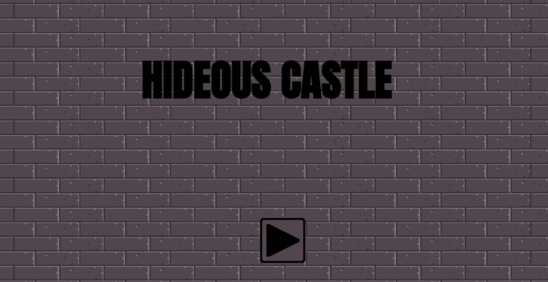

# Jogo - HideousCastle
## Por: Francisco Henrique da Silva Fuzari de Souza

### Este projeto é um jogo 2D para navegador criado com HTML e JavaScript usando Framework Phaser.js, o jogo tem como objetivo ser difícil e desafiar os jogadores. 

### O jogo possui três fases, para passar de fase basta alcançar a porta no final de cada fase, o jogador não possui qualquer instrumento e tem que desviar dos obstáculos e monstros até chegar na porta.

## Para Executar:
* WEB: Na pasta Executável-WEB Rode o arquivo index.html e ele abrirá no seu navegador.
